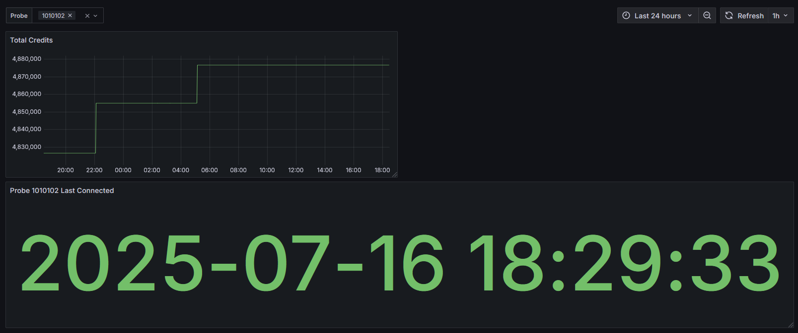

# RIPE Atlas Prometheus Exporter
   
[](https://github.com/Cyb3r-Jak3/atlas-stats-exporter/actions/workflows/golangci-lint.yml) [](https://github.com/Cyb3r-Jak3/atlas-stats-exporter/actions/workflows/go-checks.yml) [](https://codecov.io/gh/Cyb3r-Jak3/atlas-stats-exporter) 

This is a Prometheus exporter for RIPE Atlas accounts, and probes. It does not currently support RIPE Atlas measurements, but plans to in the future. This exporter does require a RIPE Atlas account, and the API key for that account. You can follow the [docs](https://atlas.ripe.net/docs/howtos/keys) to create an API key for your account.


## Usage

You can install the exporter by downloading the latest release from the [releases page](https://github.com/Cyb3r-Jak3/atlas-stats-exporter/releases/latest), pulling the Docker image from Docker Hub or GitHub Container Registry, or by building it from source.

The archive downloads previously had the version number in the name, for example `atlas-stats-exporter_1.2.3_windows_amd64.zip`. This has been deprecated and the new naming convention is just `atlas-stats-exporter_windows_amd64.zip`.

**Note**: As of v2.0.0, the docker images only support linux/amd64 and linux/arm64 architectures. If you need a different architecture, you will need to download the binary from the releases page or build it from source.

### Dashboard

There is an example Grafana dashboard available for this exporter. You can find it in the [dashboards directory](/dashboards/basic.json).

Example image of the dashboard:

### Docker
You can run the exporter using Docker with the following command:

```bash
docker run -d \
  --name atlas-exporter \
  -p 8080:8080 \
  -e ATLAS_EXPORTER_API_TOKEN=your_api_token_here \
  cyb3r-jak3/atlas-stats-exporter:latest
```

### Metrics

The exporter exposes the following metrics:
- `atlas_exporter_credits`: Number of credits available in the RIPE Atlas account.
- `atlas_exporter_probe_last_connected`: Timestamp of the last time the probe connected to the RIPE Atlas network in seconds since epoch.
- `atlas_exporter_probe_measurements`: Number of measurements the probe has performed.

### Full Configuration Variables

| Name                | Usage                                                          | Default  | Environment Variable               |
|---------------------|----------------------------------------------------------------|----------|------------------------------------|
| api_token           | **Required** Authenticates to the RIPE API                     |          | ATLAS_EXPORTER_API_TOKEN           |
| listen_address      | Sets the address to listen for HTTP requests on                | :8080    | ATLAS_EXPORTER_LISTEN_ADDRESS      |
| metrics_path        | Path to expose the metrics listener                            | /metrics | ATLAS_EXPORTER_METRICS_PATH        |
| timeout             | Timeout for the API requests in Seconds                        | 30       | ATLAS_EXPORTER_TIMEOUT             |
| tls_enabled         | Enabled TLS for the HTTP server                                | false    | ATLAS_EXPORTER_TLS_ENABLED         |
| tls_cert_chain_path | Path to the TLS certificate chain file (PEM format)            | cert.pem | ATLAS_EXPORTER_TLS_CERT_CHAIN_PATH |
| tls_key_path        | Path to the TLS private key file (PEM format                   | key.pem  | ATLAS_EXPORTER_TLS_KEY_PATH        |
| log_level           | Set the logging level (debug, info, warn, error, fatal, panic) | info     | ATLAS_EXPORTER_LOG_LEVEL           |
